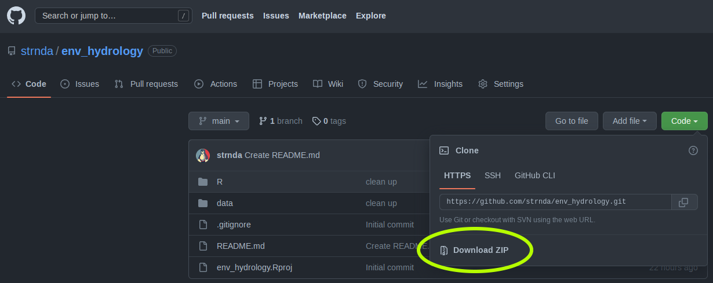
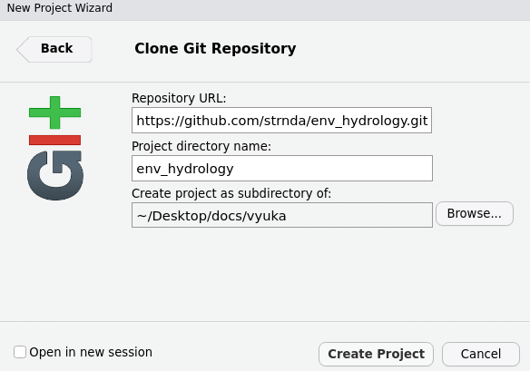

<!-- README.md is generated from README.Rmd. Please edit that file -->

# Environmental Hydrology

Collection of scripts and data for **Environmental Hydrology** class

**New
[Datacamp](https://www.datacamp.com/groups/shared_links/41eaf0594835331d7a65ca8a83e94aaed1638b3155c42041702b5724763c5ee9)
invite link**

## How to get the content of tis repo to your local machine

- without git:

``` r
## using R

if (!require(curl)) {
  install.packages("curl")
}
require(curl)


## Download the archive with all files in the repository
## (destfile is location of the future file)
curl_download(url = "https://github.com/strnda/env_hydrology/archive/refs/heads/main.zip", 
              destfile = "./data/test.zip")

## unzip the archive
unzip(zipfile = "./data/test.zip",
      overwrite = TRUE, 
      exdir = "./data/")
```

Or manualy download the archive… 

- with git

``` bash
## using bash (git) commands
git clone https://github.com/strnda/env_hydrology.git
```

Or clone it manually vie Rstudio ide interface: navigate to “New
Project” \> “Version Control” \> “git” and paste the repo URL  


# Content of the repository

- In the **R** folder you can find important scripts from the seminars
  named in logical order (1 - data import, 2 - basic data analysis,
  etc…)  
- **Data** folder contains data used as an example dataset for the
  seminars
